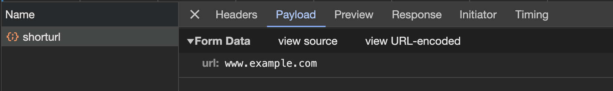

# Request Header Parser

freeCodeCamp - Back End Development and APIs | Project: URL Shortener

# Summary

Create a URL Shortener api that when you make a **POST** request to `/api/shorturl` it should return a JSON object with:

-   the Original URL in the `original_url` key.
-   the Short URL in the `short_url` key.

When you visit `/api/shorturl/<short_url>` through a **GET** request, you will be redirected to the original URL.

If you pass an invalid URL in the POST request that doesn't follow the valid `http://www.example.com` format, the JSON response will contain `{ error: 'invalid url' }`

If you pass an invalid short url to `/api/shorturl/<short_url>`, then it will return a JSON response with `{ error: 'Wrong format' }`

**[Learn more about the Project Task.](https://www.freecodecamp.org/learn/back-end-development-and-apis/back-end-development-and-apis-projects/url-shortener-microservice)**

### Implementation

-   Created a TypeScript + Express API
-   Created two routes the **POST** `api/shorturl/` and the **GET** `api/shorturl/:id`
-   the **POST** route does the following:
    -   Uses the `urls` array to store the urls send in from the **POST** request
    -   Creates a `response` objecty and it creates a shorturl by using the index of the url in the `urls` array and adding 1 to it
    -   Uses the `isValidHttpUrl` function to check if it is valid url
-   the **GET** route does the following:

    -   Uses the `id` in the route params in the url to index the `urls` array
    -   Then uses the `redirect()` function to redirect the user to the url

-   Created the `isValidHttpUrl` function to check if it a valid url
    -   It creates a url instance by doing `new URL(urlInput)`
    -   Then checks the protocol of it to see if it is `http:` or `https:` (since we are only checking for these types of URLS)
    -   If it is a string that is not valid url, then it will throw an exception and return false

### Lessons Learned

-   I was not passing two tests which were the main functionality of the api:
    -   You can POST a URL to /api/shorturl and get a JSON response with original_url and short_url properties. Here's an example: { original_url : 'https://freeCodeCamp.org', short_url : 1}
    -   When you visit /api/shorturl/<short_url>, you will be redirected to the original URL.
-   I investigated and found the following:
    -   I assumed that the data send in the **POST** was **JSON**
    -   After looking at the **Network Tab**, I saw two clues:
        -   The `request headers accept key` accepted the following `text/html,application/xhtml+xml,application/xml;q=0.9,image/avif,image/webp,image/apng,*/*;q=0.8,application/signed-exchange;v=b3;q=0.7`, but not **JSON**!
        -   In the Payload tab, it said `Form Data` along with view in `URL-Encoded`
        -   
        -   This told me that the data being send was not in JSON!
-   I found the `urlencoded` option from `bodyParser` and that helped me pass the tests
-   I learned to always check what data the client accepts! It is not alway JSON!

### Resources

-   [Accept](https://developer.mozilla.org/en-US/docs/Web/HTTP/Headers/Accept): The Accept request HTTP header indicates which content types, expressed as MIME types, the client is able to understand.
-   [Request header](https://developer.mozilla.org/en-US/docs/Glossary/Request_header): A request header is an HTTP header that can be used in an HTTP request to provide information about the request context, so that the server can tailor the response
-   Notes on body-parser:
    -   Before parsing, the incoming data will be a regular string that could not access the data encoded inside, but after parsing, it becomes a JavaScript object where it can access the various data within.
    -   body-parser is an NPM package that parses incoming request bodies in a middleware before your handlers, available under the req.body property.
    -   `bodyParser.json()` looks at requests where the Content-Type: application/json header is present and transforms the text-based JSON input into JS-accessible variables under req.body. \
    -   `bodyParser.urlencoded({extended: true})` does the same for URL-encoded requests. The extended: true precises that the req.body object will contain values of any type instead of just strings.
-   `application/x-www-form-urlencoded` - is a MIME type used for encoding form data when it is submitted in HTML forms. It is the default encoding type for HTML forms and is widely used in web applications for sending data from the client (browser) to the server. - When a form is submitted with the application/x-www-form-urlencoded encoding type, the form data is encoded in key-value pairs, separated by "&" characters. Each key-value pair is URL-encoded, meaning that special characters are replaced with their corresponding percent-encoded values. The key and value are separated by the "=" character. - For example
    ```
    <form method="post" action="/login" enctype="application/x-www-form-urlencoded">
        <label for="username">Username:</label>
        <input type="text" id="username" name="username">
        <label for="password">Password:</label>
        <input type="password" id="password" name="password">
        <input type="submit" value="Submit">
     </form>
    ```
-   If the user enters "john_doe" for the username and "secret123" for the password, the data sent in the HTTP request would look like this:
    ```
    POST /login HTTP/1.1
    Host: example.com
    Content-Type: application/x-www-form-urlencoded
    username=john_doe&password=secret123
    ```

### Demo


# Technologies:

-   JavaScript
-   TypeScript
-   Render
